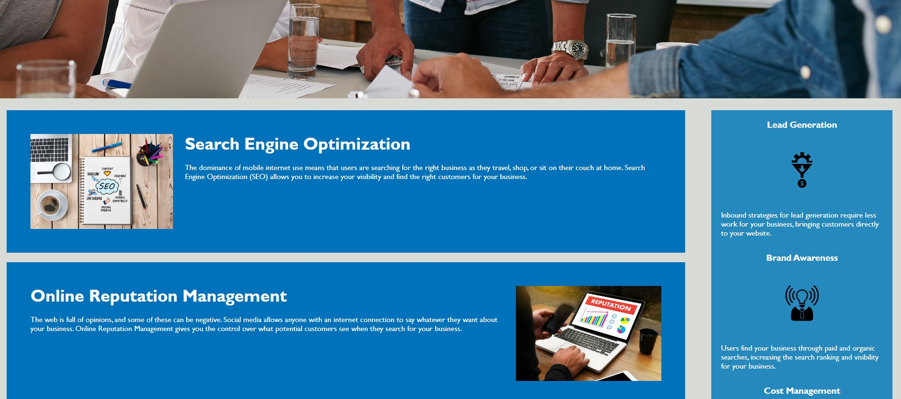

# 01 HORISEON - Main Page Updated for Accessibility and Visibility

## Purpose

The goal of this projet was a refactoring of the Horiseon main landing page, in order to make it more accessible, streamlined, and easy to read in the HTML and CSS. While the layout of the site was not in need of any great deal of editing, certain changes were made to make potential clients and search engines better able to find and access the page's content.

### HTML Changes

The HTML made frequest correct but unideal use of div elements, which have been changed to semantic HTML to better meet modern standards. This can make the page more intelligible to those using screen reading software. Likewise, the inclusion of alt text on images - though largely decorative - can instruct these programs in how to describe this content to the visually impaired.

Additionally, the inclusion of an id attribute on one article in the .content section fixed a link with no address in the nav bar.

### CSS Changes

The CSS was well laid out but inefficient in some small ways, such as repeating code often for different classes with identical stylings. Collapsing these into single blocks of code, along with the inclusion of comments to indicate what pieces of code apply to which pieces of the page (when this was not self-evident), improved readablility without altering the layout or styling of the page:

### Deployed Site

https://shanep42.github.io/Horiseon-Semantic-HTML/

### Future Developments

Currently, the page is still not very responsive to changes in screen size, and can look messy at small sizes. With more advanced CSS, it should be easy enough to retain the layout or have it switch to a more mobile-friendly alternative below certain throughholds using media queries.
